# RideZ 
Joyfull and Comfortable travel 
<a href="https://www.dropbox.com/s/8iireeb52o4tmkt/RIDEz.apk?dl=0">DOWNLOAD THE APP</a> 
FRONT END : FLUTTER  
BACK END : LARAVEL 

For backend 
  <a href="https://cabbookingback.000webhostapp.com/admin">Click here</a> 
  <h5>Or Go To https://github.com/basitmir/cab_booking_backend</h5>
  

<h4>To test the app</h4> 
UserLogin credentials :  

 UserName : basit@gmail.com 
    PassWord : basit@gmail.com

 DriverLogin credentials :  

 UserName : driver@driver.com 
    PassWord : driver@driver.com

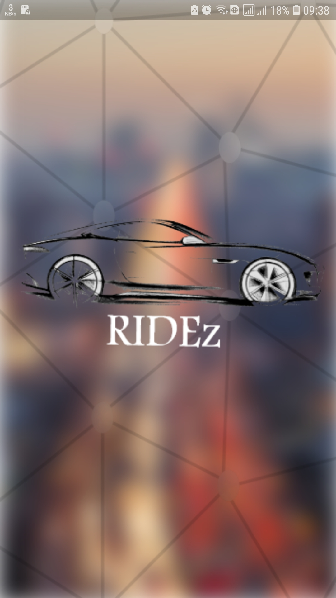
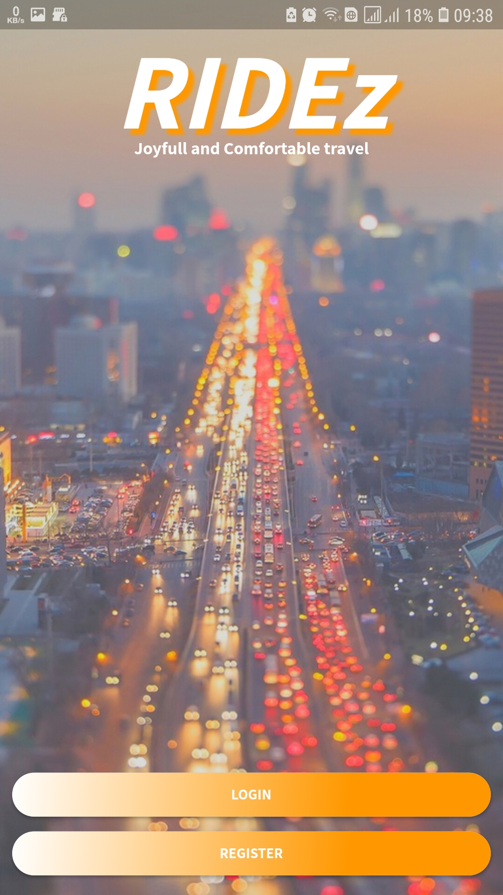

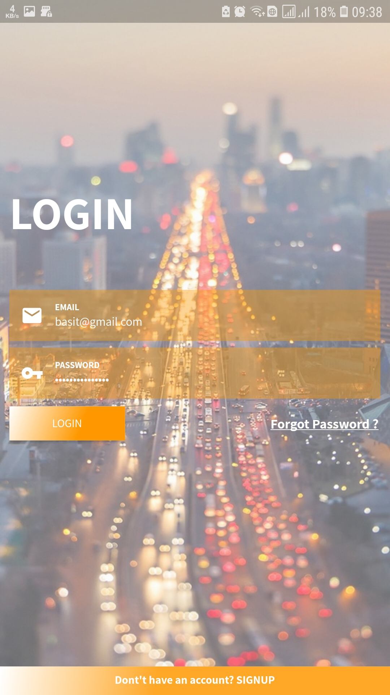
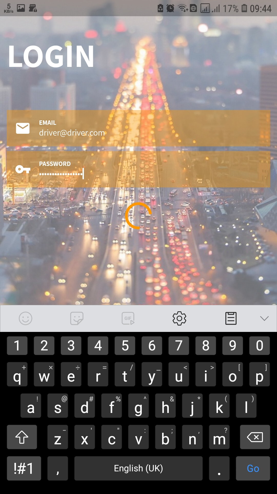

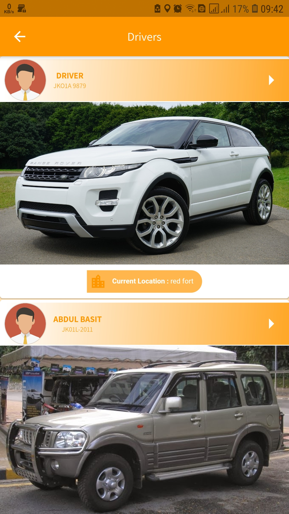
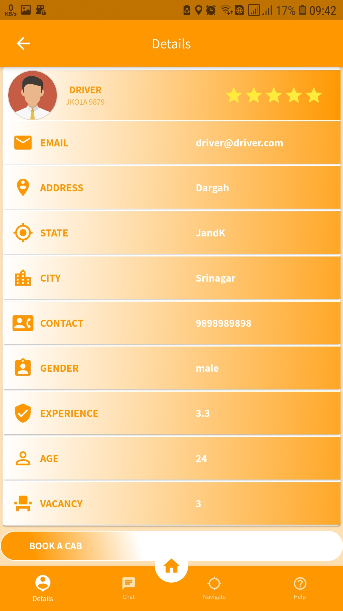

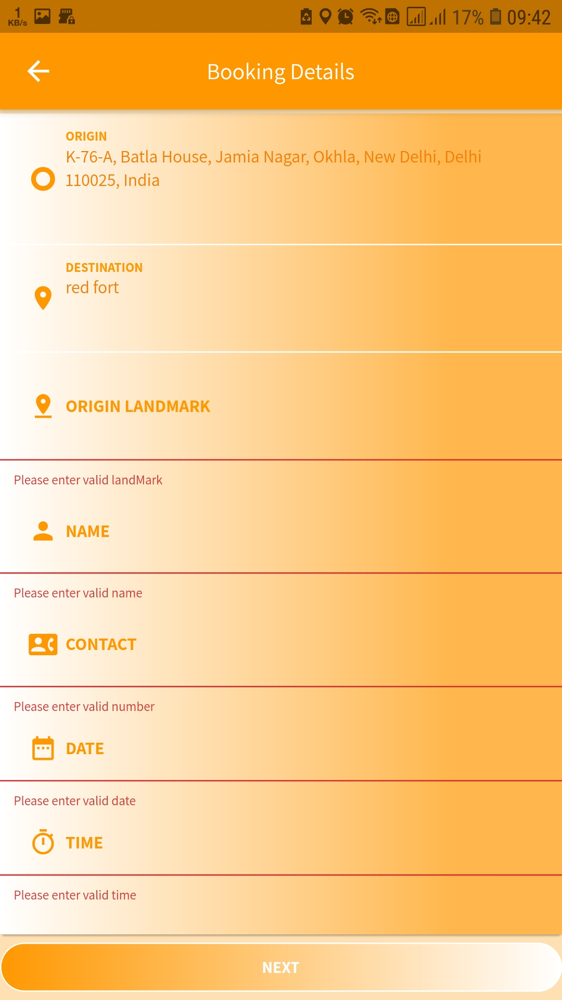

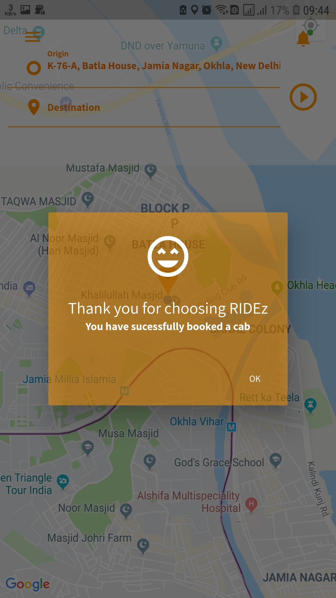
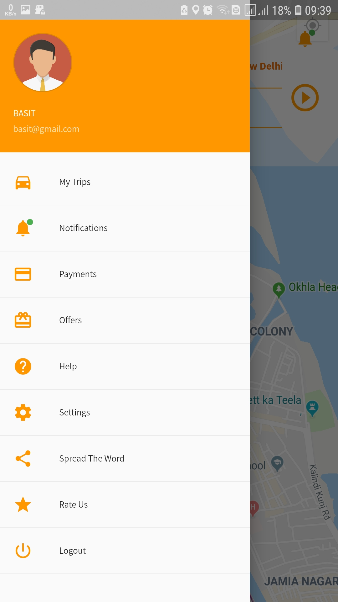
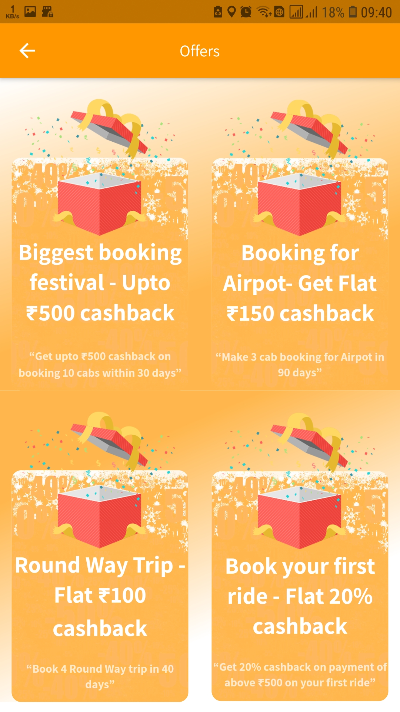

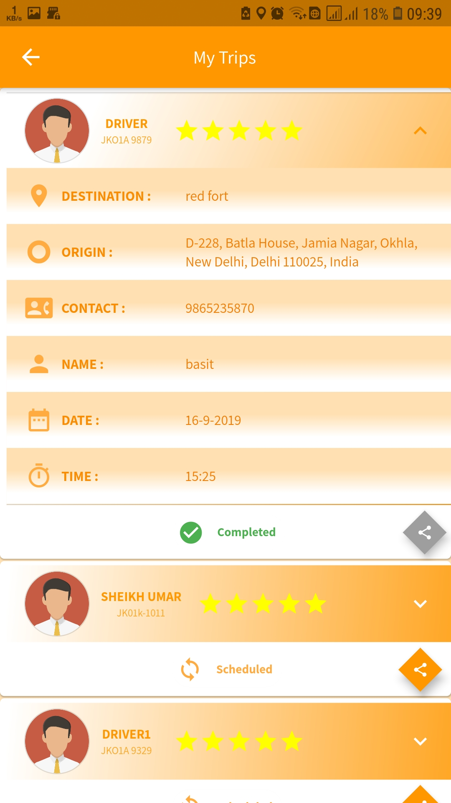
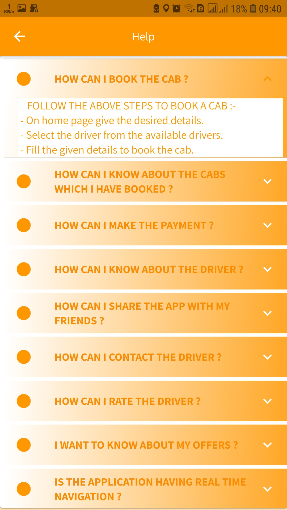

Drivers Dashboard  

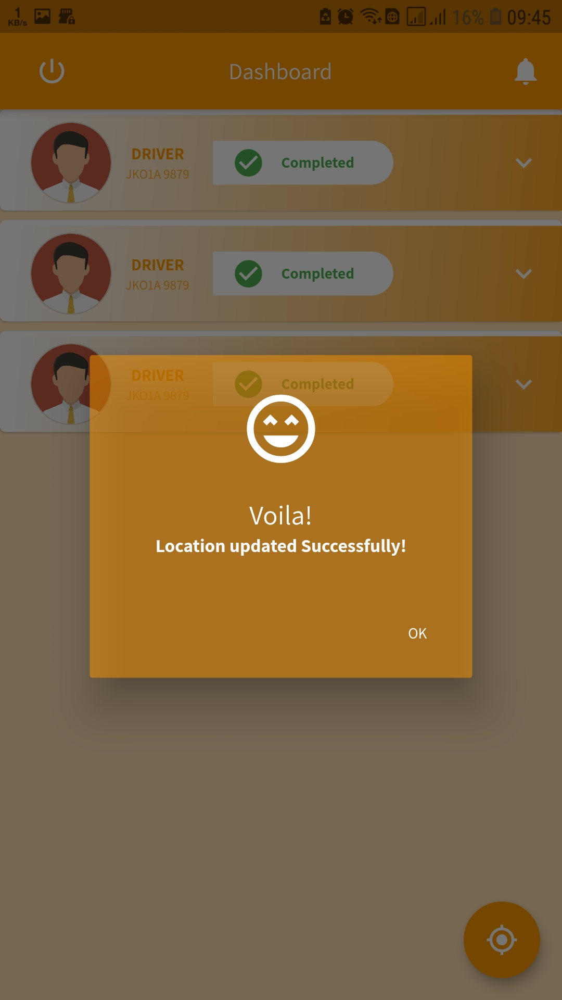

  

## Getting Started

This project is a starting point for a Flutter application.

A few resources to get you started if this is your first Flutter project:

- [Lab: Write your first Flutter app](https://flutter.dev/docs/get-started/codelab)
- [Cookbook: Useful Flutter samples](https://flutter.dev/docs/cookbook)

For help getting started with Flutter, view our
[online documentation](https://flutter.dev/docs), which offers tutorials,
samples, guidance on mobile development, and a full API reference.
